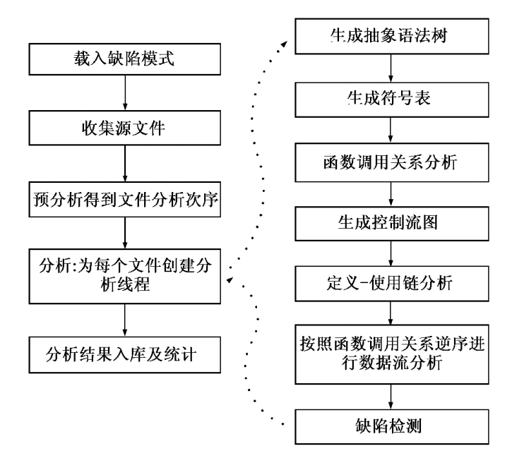
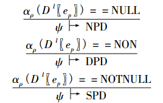
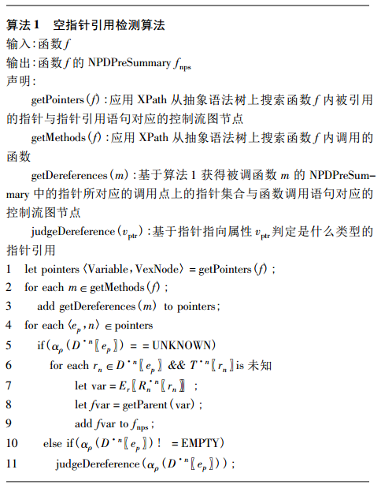

文献《基于区域内存模型的空指针引用缺陷检测》

1.  提出静态检测框架DTSC

1.  提出基于区域的符号化三值逻辑RSTVL

RSTVL定义为四元组RSTVL=（Var , Region , SExp ,
Domain），用于描述标量类型的内存对象。Var表示内存对象，Region表示区域，SExp表示符号表达式，Domain表示取值区间。

对不同类型的内存对象，RSTVL用不同类型区域对其存储状态进行抽象描述。PrimitiveRegion描述基本类型的内存对象，PointerRegion描述指针，ArrayRegion描述数组，StructRegion描述结构体。每个区域都有唯一的编号，其中空指针的区域编号为“null”，野指针的区域编号为“wild”。

将对v、var.f、var［n］等内存对象分配的区域称为安全区域，将动态分配的区域称为动态区域，将为参数或全局变量分配的区域称为未知区域，对这三种区域统称为可操作区域。将“null”与“wild”标识的区域称为不可操作区域。动态区域与未知区域经过非空判断后变为安全区域，动态区域与未知区域经过是空判断后变为不可操作区域．

RSTVL
将内存划分为离散的区域，能够描述区域间的指向关系、层次关系以及取值的逻辑关联，可满足流敏感、域敏感的数据流分析。在每个程序点l，Rl
表示在l处 能够被访问的区域集合，Sl =〈s，domain〉表示在 l
处使用的符号及其区间集合。每个程序点 l 都有一个抽象存储 ρ l = ( ρlv，ρlr，ρlf )
． 其中: ·

ρlv: Var→Rl ，映射一个内存对象到一个区域; ·

ρlr : Rl →Rl ，表示区域间的指向关系; ·

ρlf : (Rl× F) →Rl ，映射一个复合类型内存对象的成员到一个区域．

1.  提出了空指针引用检测方法

对每个指针的指向属性描述为：: ALPTR = ( VPTR，Fjoin，Fmeet )。

>   VPTR为指针指向属性的集合。包括以下几种：

>   EMPTY：指针的初始属性。

>   NULL：指针指向空地址。

>   NOTNULL：指针指向安全区域。

>   NON：指针可能指向空地址。

>   UNKNOWN：表示指针的指向不确定。

>   Fjoin : VPTR × VPTR→VPTR是 ALPTR的最大下界函数。

>   Fmeet : VPTR × VPTR→VPTR是 ALPTR的最小上界函数。

>   对Fjoin，Fmeet的操作包括：

>   Fjoin ( X，UNKNOWN) = X

>   Fmeet ( NOTNULL，UNKNOWN) = UNKNOWN

>   Fmeet ( NULL，UNKNOWN) = NON

>   Fmeet ( NON，UNKNOWN) = NON

>   Fmeet ( EMPTY，UNKNOWN) = UNKNOWN

>   Fmeet ( UNKNOWN，UNKNOWN) = UNKNOWN

>   指针为pd，指针的指向属性的抽象化函数 αlρ定义为：

>   ./media/image2.PNG

用 Dle表示在程序点 l 上可寻址表达式 e 的取 值区间，ψ
表示空指针引用缺陷检测点的上下文环境， NPD 表示肯定空指针引用，DPD
表示可能空指针引用， SPD 表示安全指针引用。指针判断规则如下：

如果指针 ep 在程序点 l 上的指向属性为EMPTY，说明程序点 l
出现了矛盾，为不可达程序点，ep不可能被实际引用，不需要进行判定。如果指针 ep
在程序点 l
上的指向属性为UNKNOWN，表明在当前的函数内不能确定是否为空指针，需要将与其具有别名关系且指
向属性也是UNKNOWN的外部指针变量添加到当前函数的NPDPreSummary中。

1.  提出空指针引用检测算法

（指针引用检测对象）：具有明确指向属性的指针，且其所指向的地址被访问，通过检测该指针变量是否为空指针可以判定是否产生空指针引用。

DTSC在以每个函数为单位进行空指针引用缺陷检测，首先识别出被引用的指针，然后根据基于被引用指针的指向属性根据指针引用判定规则对其进行判定，具体处理流程如算法
1 所示。

