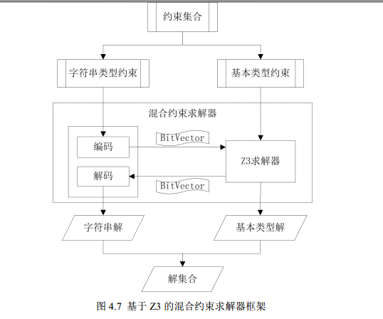

本文并没有将约束求解作为研究的重点，而是实现了一个通用的约束求解调度模型，可以将系统的约束问题转换成其他约束求解器理解的数据类型。同时我们也基于
Z3 求解器实现了一个字符串约束求解器。

通用约束求解器：

通过调度器来调度不同的约束求解器。例如，Z3 以及 Yices
支持对整数相关的约束进行求解，当程序中只含有此类约束的时候，可以通过调用 Z3 或者
Yices 来进行约束求解。而当程序中只包含字符串类型的约束时，Z3 和 Yices
已经无法满足求解需求，这时需要调用Hampi 等可以求解字符串相关约束的求解器。

通用约束调度模型=约束分离器+各个约束求解器的适配器

约束分离器：判断约束的类型（字符串类型、基本类型或都有）从而选择合适的求解器（分布对应字符串类型/基本类型/混合
约束求解器）

| 算法 **3.2** 约束分离算法(solveDispatch)                                                                                                                                                                                                                                                                                                                                                                                                                                                                                                                                                                                                                            |
|---------------------------------------------------------------------------------------------------------------------------------------------------------------------------------------------------------------------------------------------------------------------------------------------------------------------------------------------------------------------------------------------------------------------------------------------------------------------------------------------------------------------------------------------------------------------------------------------------------------------------------------------------------------------|
| 输入：约束集合，数据依赖图                                                                                                                                                                                                                                                                                                                                                                                                                                                                                                                                                                                                                                          |
| 1. constraints:约束集合                                                                                                                                                                                                                                                                                                                                                                                                                                                                                                                                                                                                                                             |
| 2. strFlag:约束中是否含有字符串类型的约束                                                                                                                                                                                                                                                                                                                                                                                                                                                                                                                                                                                                                           |
| 3. baseFlag:约束中是否含有基础类型约束                                                                                                                                                                                                                                                                                                                                                                                                                                                                                                                                                                                                                              |
| 4. baseConstriantSolver:专门求解基本类型的约束求解器                                                                                                                                                                                                                                                                                                                                                                                                                                                                                                                                                                                                                |
| 5. strConstriantSolver:专门求解字符串类型的约束求解器                                                                                                                                                                                                                                                                                                                                                                                                                                                                                                                                                                                                               |
| 6. mixConstriantSolver：混合约束求解器                                                                                                                                                                                                                                                                                                                                                                                                                                                                                                                                                                                                                              |
| **7. step 1**：判断约束集合中约束类型                                                                                                                                                                                                                                                                                                                                                                                                                                                                                                                                                                                                                               |
| 8. foreach(cons : constraints)                                                                                                                                                                                                                                                                                                                                                                                                                                                                                                                                                                                                                                      |
| 9. 集合中含有字符串类型约束                                                                                                                                                                                                                                                                                                                                                                                                                                                                                                                                                                                                                                         |
| 10. strFlag = true;                                                                                                                                                                                                                                                                                                                                                                                                                                                                                                                                                                                                                                                 |
| 11. 集合中含有基本类型约束                                                                                                                                                                                                                                                                                                                                                                                                                                                                                                                                                                                                                                          |
| 12. baseFlag = true;                                                                                                                                                                                                                                                                                                                                                                                                                                                                                                                                                                                                                                                |
| 13. endFor                                                                                                                                                                                                                                                                                                                                                                                                                                                                                                                                                                                                                                                          |
| 14. **step 2**：选择合适的约束求解方式                                                                                                                                                                                                                                                                                                                                                                                                                                                                                                                                                                                                                              |
| 15. if(strFlag && baseFlag)// 混合约束                                                                                                                                                                                                                                                                                                                                                                                                                                                                                                                                                                                                                              |
| 16. mixConstriantSolver                                                                                                                                                                                                                                                                                                                                                                                                                                                                                                                                                                                                                                             |
| 17. else if(strFlag )// 仅含有字符串类型约束                                                                                                                                                                                                                                                                                                                                                                                                                                                                                                                                                                                                                        |
| 18. strConstriantSolver                                                                                                                                                                                                                                                                                                                                                                                                                                                                                                                                                                                                                                             |
| 19. else // 仅含有基本类型约束                                                                                                                                                                                                                                                                                                                                                                                                                                                                                                                                                                                                                                      |
| 20. baseConstriantSolver                                                                                                                                                                                                                                                                                                                                                                                                                                                                                                                                                                                                                                            |
| 21. endif                                                                                                                                                                                                                                                                                                                                                                                                                                                                                                                                                                                                                                                           |

约束适配器：将不同的约束类型转换成该适配器所要适配的约束求解器能够理解的数据类型

>   约束类型：对于不同的约束，系统设计了不同的约束类来表示，这样在约束转换求解的时候，可以很方便的识别出约束的类型继而转换成约束求解器可以理解的约束表达式。

>   约束系统中主要将约束分为两大类，一种是只含有基本类型的约束，主要包括比较运算(例如
>   \>，\<，==，\<=)、布尔值以及逻辑运算。另一种则是字符串类型的约束，这些约束主要是表达字符串操作函数中返回值为布尔型的函数。

二、字符串约束求解器&混合约束求解器：

基于Z3实现

目前大多数的约束求解器能够解决整型等基本类型的约束条件，但是现实程序中有很多漏洞是由字符串引起的，比如SQL注入、跨站脚本攻击等，传统的约束求解器已经不能满足这样的求解需求。因此，实现一个能够解决字符串约束的约束求解器具有十分重要的实际意义。

当前**存在很多种约束求解器可以对程序中含有字符串的约束进行求解，比如
Hampi[56]，Kaluza[58]等等。这些求解器本身也是建立在其他 SMT
求解器基础之上的，它们的缺点仅仅是只能对字符串类型的约束进行约束求解，并不能求解同时含有整型，浮点型的约束。**而现实中绝大部分的程序都是字符串与非字符串等各种混合类型组成的，因而这样的求解器很难广泛的适用于现实中的程序分析。

因此，本节将实现一个基于 Z3 的字符串约束求解器（Z3-Based String
ConstraintSolver，简称 Z3-ss），不仅能够对字符串类型的约束进行求解，而且还保持了
Z3 本身先进的求解技术，从而达到对混合的约束进行求解的目的。

同其他 SMT 求解器一样，Z3 本身并不支持字符串类型的约束。Z3
支持的求解类型有整型、布尔型、数组和位向量等。

**1、字符串转化——基于位向量的字符串约束表示：**

位向量(BitVector)是由若干个位（*bit* ）所组成，每个 bit都由 0 或 1
来表示，分别代表 false 和 true。

一个字符串由若干个字符组成，每个字符我们使用一个 8
位的二进制来表示。例如，字符”a”在 ASCII 表中对应的数字是 97，使用 8
位的二进制表示就是01100001。因此，在系统中我们可以使用一个 8 位的 BitVector
来对应 ASCII 码表中的一个字符，使用一个 BitVector
数组来表示一个字符串变量或者常量。字符串就由若干个 8 位的 BitVector 组成。

**2、字符串操作的约束转化**

以 *s*0 .contains( *s*1)=true 为例，假设 *s*0和 *s*1的长度分别是 5 和
3。考虑该操作的含义： *s*0中包含 *s*1。对应的情况有三种：1， *s*0的前三个字符与
*s*1相等；2， *s*0的中间三个字符与 *s*1相等；3，*s*0的后面三个字符与
*s*1相等。这三种情况之间的关系是逻辑或关系。那么对于 contains
这个函数操作的语义就有对字符串的约束如下：

对于其他常见的字符串操作函数，表 4.3 给出了相应的约束形式:

(假 设 给 定 的 程 序 路 径 中 有 语 句 *s*0 .equals( *s*1 ) 、 *s*0
.endsWith(“end”) 、  
*s*1.startsWith(“start”)，且路径的执行要求这三条语句的返回值均为 true。由于变量
*s*0、  
*s*1的长度是未知的，程序的一般做法是从字符串长度为 1 开始，依次计算该长度下  
对应的约束是否有解。如果计算到了长度上限还没有得出对应解，那么可以认为该  
路径可能是不可达的。)

3、总体转换流程图：

这里给出将字符串表达式转换成位向量形式的转换流程图。  
如图 4.9 所示，首先获取需要转换的表达式，然后判断是否是字符串常量，如果是则  
对照 ASCII 码表转换该字符串常量为相应的位向量，否则接着判断是否是字符串变  
量。如果是，那么找出该变量对应的 StringVar，获取该变量中已经初始化过的位向  
量。如果该表达式既不是常量也不是变量，那么就是含有字符串操作函数的函数调  
用。获取函数名 mName 以及调用该函数的对象 base，利用递归调用获取 base 对象  
的位向量形式，接着根据函数名执行后续的转换逻辑。
