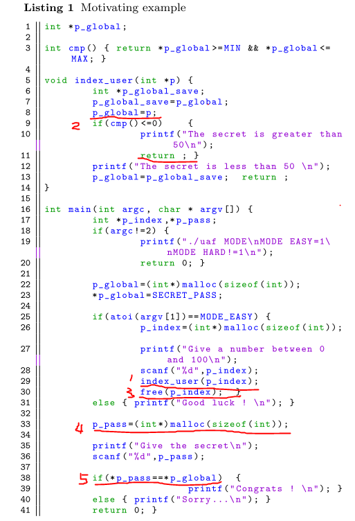
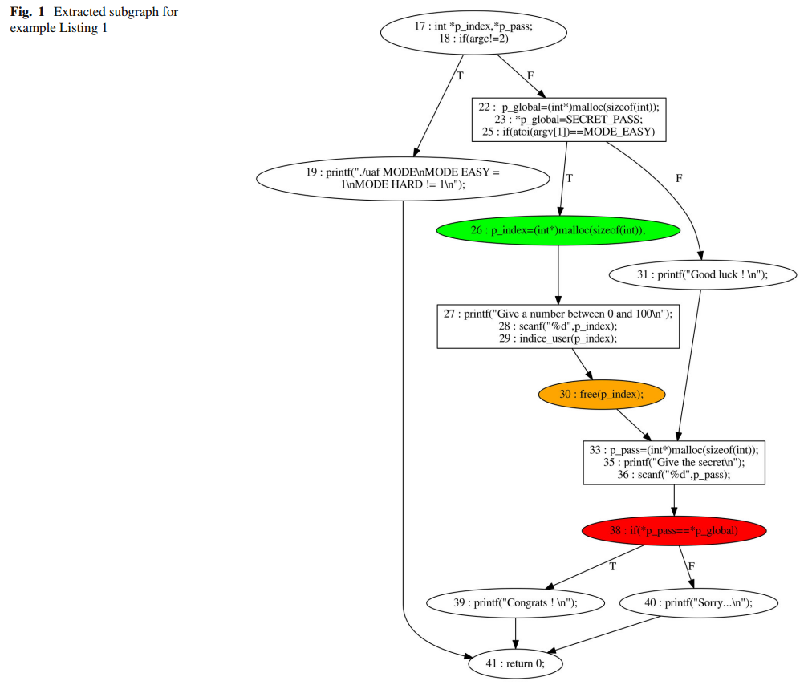
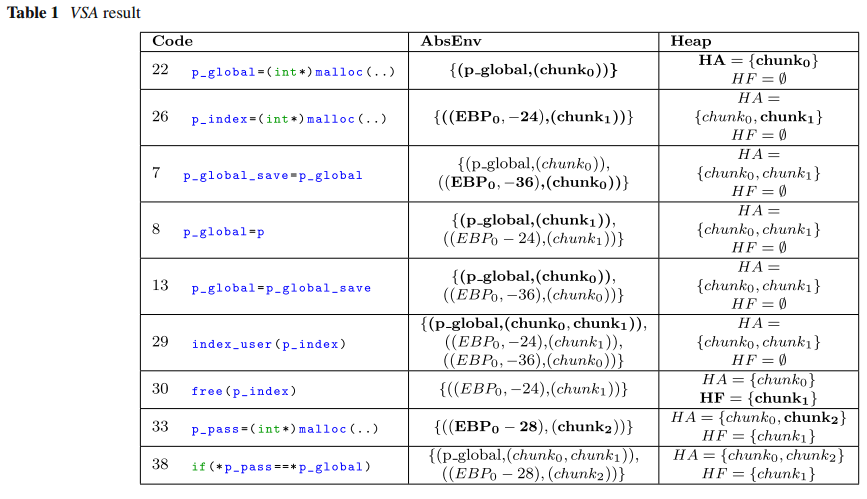

面向二进制代码的UAF静态检测
===========================

提出了一个面向反汇编代码的静态UaF检测工具GUEB，使用该工具发现了实际漏洞CVE-2011-4130。GUEB：Graph
of Use-After-Free to Expoit Bianry。

1.简介
======

Fuzzer需要识别程序哪些部分应该被重点关注，为此，静态识别漏洞模式是一种方法。

UaF两个特征：产生悬空指针，之后访问该指针指向内存，因此检测UaF需要分析很长的执行序列，在大型程序中这将是一个挑战。使用纯动态分析很难检测这种模式。

本文目标：识别二进制代码中包含UaF的程序位置集合，并适用于大规模程序，为漏洞检测提供第一步。

1.1一个动机实例
---------------

第38行对p\_global UaF，导致比较总是成立。

1.2本文方法
-----------

首先，跟踪堆操作和地址传递，用于别名分析；

然后，使用前面分析结果静态识别UaF；

最后，解析出UaF的子图。

动机实例解析出的UaF如图：

1.3相关工作
-----------

当前存在面向C源代码的静态UaF检测工具，Polyspace、Frama-C。这些工具主要检查程序中不能接受的约束，如C中未定义的行为。

但是，提升静态分析到二进制代码是非常具有挑战性的，当前学术界提供了基于中间语言的静态分析平台：REIL，BAP，Bincoa，但是没有成熟UaF检测功能。

当前，面向二进制的UaF检测工具是基于动态方法的，例如AddressSanitizer，需要使用特定的库编译源码形成二进制。Undangle：从给定执行迹开始，致力于识别形成悬空指针的程序点。这种方法需要识别导致UaF的路径，插桩每个汇编指令，导致执行效率下降。

2.内存模型和值分析
==================

堆栈元素如何被表示。

2.1抽象内存表示
---------------

每个栈元素表示为（EBP0，offset），EBP0表示EBP初始值，offset表示元素相对于EBP的偏移。

堆内元素表示为（base，size），base是分配标识，size是分配大小。

定义两个集合HA和HF分别表示当前状态已分配和已经释放的堆元素。

2.2值集分析
-----------

值集分析的目的是静态检测哪个程序点分配或释放哪个堆元素。并跟踪地址传递，分配大小。每个程序点定义absenv抽象环境，用来表示当前指令地址包含的每个内存地址可能的值。实例程序的值集分析结果如图：

本文值集分析不需要复杂的数值计算，关注内存分配，访问，计算分配大小之间的别名。通常UaF漏洞是循环换不敏感的。因此，循环仅展开一次。

定义malloc和free的转移函数。

3.UaF检测和子图提取
===================

3.1UaF检测

在值集分析结果中，仅关注REIL指令中的两个和内存访问相关的指令：LDM和STM。如果一个程序点访问一个堆块，并且该堆块被释放，则认为是UaF。

3.2UaF子图提取

提取三个部分：1.使用点前驱和释放点后继的交集；2.释放点前驱和分配点后继的交集；3.分配点前驱到程序入口。

4.结论
======

4.1实验结果
-----------

GUEB使用IDApro进行对二进制进行反汇编，并使用BinNavi翻译到REIL中间语言。最后使用BinNavi接口Monoreil实现了控制流图上的静态分析。

在实际漏洞CVE2011-4130上进行评估，手工选择了10个目标函数，30分钟分析了CFG中的2200个节点，没有误报，提取出了包含UaF的460个节点。

4.2值集分析实现的问题和改进方法
-------------------------------

相比于动态分析，静态具有较高的覆盖率，特别是针对程序的重点部分可以进行深度分析。

不足和改进：1.值集分析可以更加优化，一层循环展开可能产生漏报或错误的分配大小。2.使用简单的内联进行程序间分析，可扩展性不强，计算开销较大。3.基于REIL的框架，GUEB使用Jython开发，效率低，可以考虑C/C++。

4.3展望
-------

为了构造能够利用UaF的输入，下一步需要分析UaF的利用特点，需要更加细粒度的堆模型。
