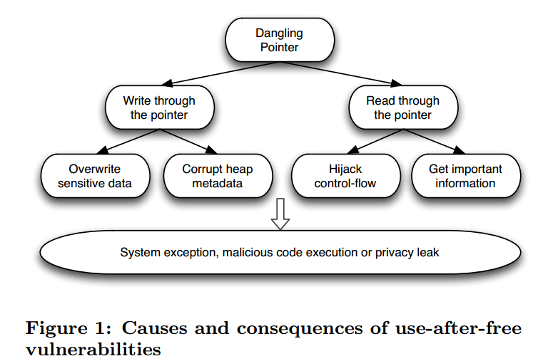
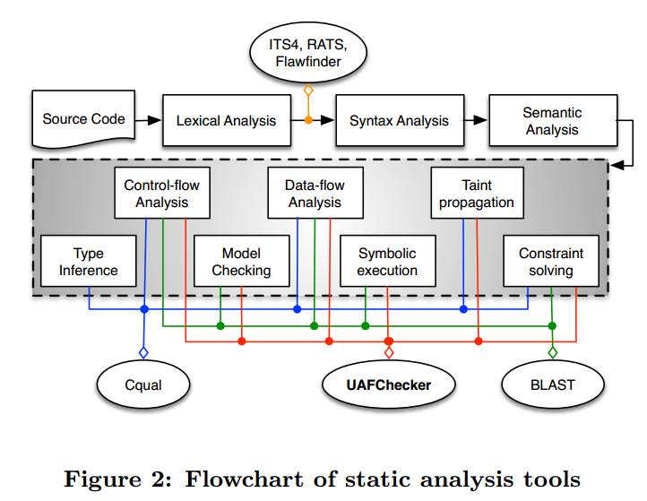
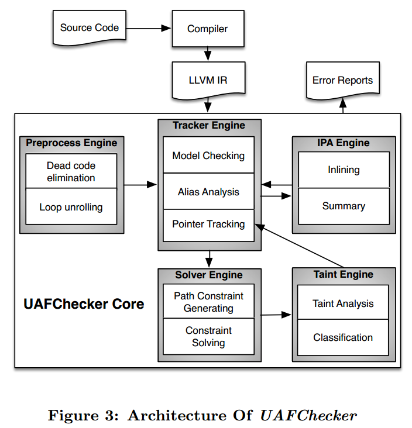
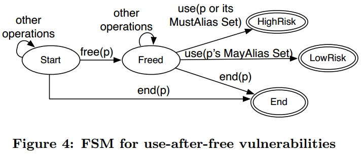

UAFChecker：可扩展的UAF静态检测
===============================

摘要：近年来，大量UAF被利用，威胁到系统安全。本文提出了面向源码的UAF检测工具UAFChecker，使用了静态分析技术：污点分析和符号执行，进行过程间分析，低误报、低漏报。基于LLVM实现了UAFChecker，使用Juliet测试集评估了UAFChecker的能力；并发现两个开源应用功能的UAF漏洞。

1.简介
======

对悬空指针的再引用引起UAF漏洞，double-free也属于UAF。UAF出现在不同目标中，涵盖了Ms、Google、Mozilla，几种利用方式如图，可导致信息泄露、恶意代码执行、系统异常等。

现有研究分为两类：静态分析和动态分析。静态分析缺少别名分析、过程间分析或不支持多语言平台。动态分析开销大、程序执行空间覆盖率低导致漏报高。

本文静态分析结合了污点分析和符号执行，能够进行别名分析和过程间分析，基于LLVM可支持多语言。

2.设计实现
==========

2.1比较
-------

UAFChecker流图如图。首先，在源码上进行静态词法分析获得token stream。基于token
stream使用ITS4，RATS，Flawfinder等工具可以发现UAF的候选集。这些工具开发简单，存在大量误报。为减少误报需要使用语法分析、语义分析进一步理解程序。Cqaul结合控制流分析、数据流分析、污点分析、类型引用和约束求解，但其约束图遍历不适用于所有情况。BLAST结合了控制流分析、数据流分析、模型检查、符号执行和约束求解，因为一些近似假设导致其误报和漏报高。本文于BLAST相似，加入了污点分析。

2.2架构
-------

源代码编译成LLVM，作为UAFChecker的输入。

·预处理引擎

处理死代码、循环展开问题。循环仅展开一次。

·跟踪引擎

建立了UAF漏洞的有限状态机模型，如图。一个指针或MustAlias别名由开始变为freed再被使用则变为HighRisk，同时指针的MayAlias别名变为LowRisk。当函数分析结束或者指针被重新赋值则变为结束。追踪引擎别名分析决定指针的MustAlias和MayAlias。减少误报。

·过程间分析引擎

应用过程间分析提高准确性。使用函数内联和函数摘要实现过程间分析。函数内联沿函数调用图自底向上分析，该方法准确，但不适用于大规模程序；函数摘要仅计算必要信息，降低准确性但可扩展性强。

·求解引擎

使用符号执行减少误报，检查从free到use的路径约束是否满足。（怎么引入符号变元？）

·污点分析

关注受输入影响的不可信指针。（可行吗？）

3.初步试验
==========

在Juliet测试集中，920秒发现616个double-free漏洞，其中658个是已知的，401秒发现342个已知的UAF。误报6%，漏报是零。42个误报因为别名分析造成的，相比于其他静态检测工具Clang
Static Analyzer、CppCheck，UAFChecker性能很好。

UAFChecker在libssh-0.5.2发现12个UAF，9个已知CVE，3个误报。在libarchive-2.8.4中发现1个已知漏洞。

4.结论
======

UAFChecker使用静态分析发现UAF，综合了别名分析和过程间分析，使用了污点分析和符号执行，可适用于大规模程序，低误报和漏报。
