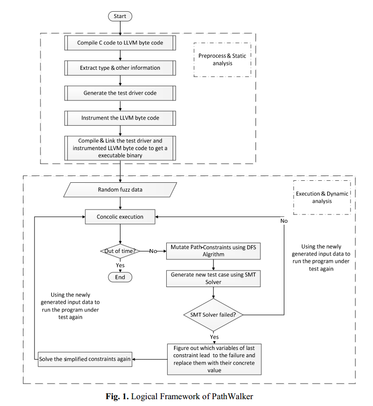
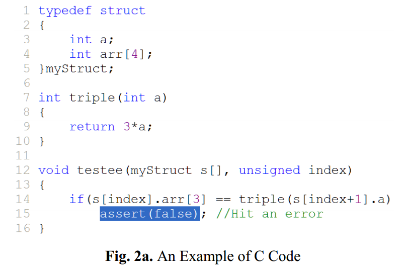
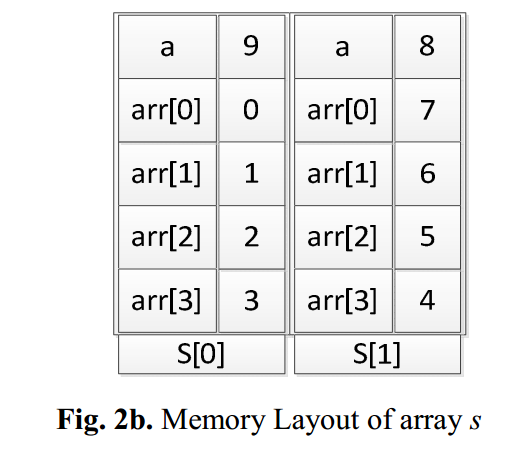
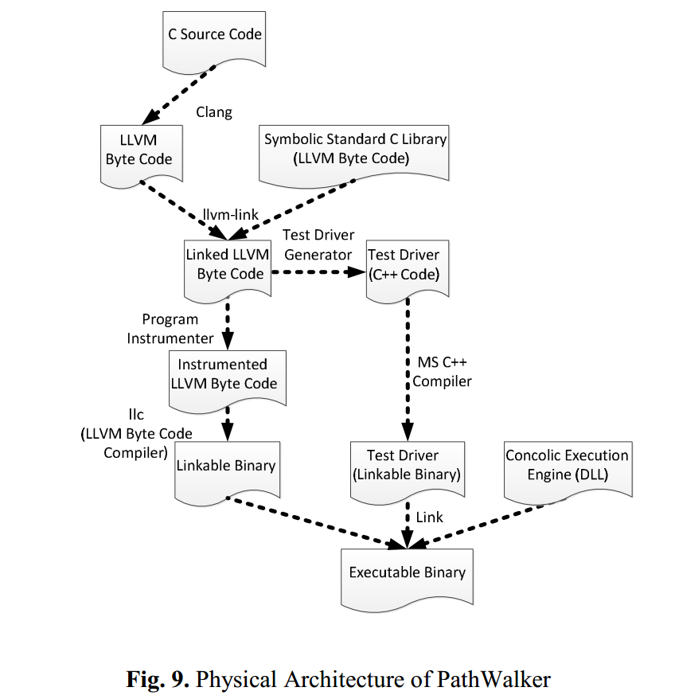
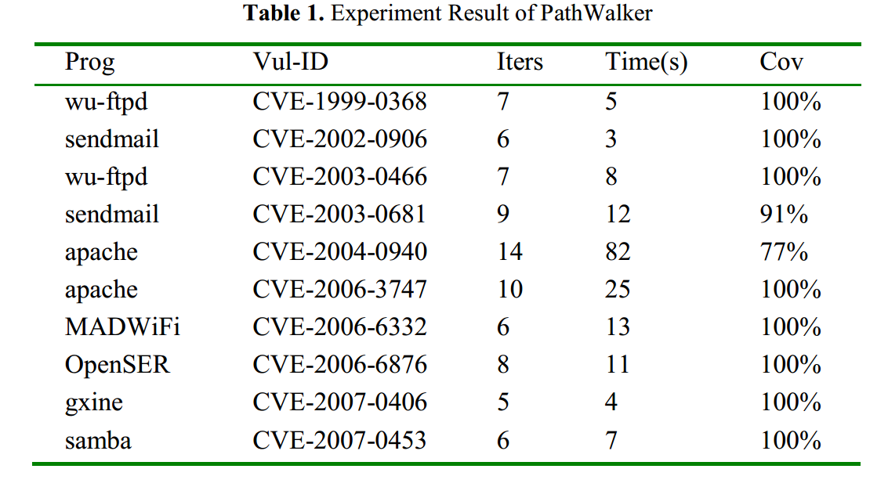

PathWalker:基于LLVM字节码检测的动态符号执行工具
===============================================

**摘要**
动态符号执行是见符号执行增加到具体执行中，是程序分析和软件测试的有力方法。本文提出了一种处理C程序的集合类型（如指针、数组、结构体
）及其复杂组合的动态符号执行。该方法的主要思想是将复杂类型的程序变量拆分为一系列的原始类型变量。在程序的具体执行过程中，提供了一个
concolic
执行引擎，以观察每个程序变量在原始类型级别上的操作，然后更新程序的符号状态。收集满足当前执行路径运行的约束，用来生成发现新路径的测试用例。我们的方法保证只有原始类型变量可以出现在符号状态和路径约束中。基于LLVM字节码检测，我们提出了一种新的工具，称为PathWalker，它实现了这种方法。实验结果表明，PathWalker在C代码中处理复杂类型是有效的。

关键字：动态符号执行，程序插桩，LLVM 集合类型

1 介绍
======

图1 PathWalker的逻辑架构

PathWalker包含两部分：静态分析，使用Clang将C源代码编译成LLVM中间语言，然后，解析类型信息和其他字节码的静态信息生成测试驱动。测试驱动器接收随机初始化输入来执行被测函数，然后读取SMT求解器结果反馈执行被测函数。

插桩步骤读取字节码并且在动态符号执行引擎中插入额外函数调用。最后，编译插装后的LLVM字节码生成动态链接库，并且和编译后的测试驱动和动态符号执行引擎库进行连接，形成可执行二进制文件。

动态阶段解释如下：

1 测试驱动接收随机初始化的输入执行被测函数，并且调用被测函数。

2
在程序实际执行过程中，动态符号执行引擎观察程序的动态行为并且更新符号表的符号状态。

3
执行完一条路径，得到一个路径约束的序列。PathWalker按照深度优先顺序取反一个约束，形成变异的路径约束。

4 利用SMT求解生成新的输入数据，驱动执行新路径。

5 如果求解成功，测试驱动将利用新的测试用例调用被测函数。

6
如果求解失败，PathWalker将使用满足最后约束的具体值代替符号值，并求解简化的路径约束。

**主要贡献：**

1
从复杂类型中解析结构信息：如何有效地处理复杂类型是符号执行的一个挑战。本文提出了一种方法来分解C代码中数组，结构体和指针类型的组合，并且将一个组合类型变量分解成一系列的原始类型变量。

2
自动化生成测试驱动：避免了人工写测试驱动代码，PathWalker利用从复杂类型中解析的信息自动化的生成测试驱动。

3
实现和评价：基于LLVM字节码插桩实现了动态符号执行工具，为复杂类型生成测试用例。实验表明该方法的有效性。

2 例子
======

图2a为一个测试函数，触发错误需要满足s[index].arr[3]==3\*s[index+1].a，对于无法处理指针引用，集合类型，或者地址计算的动态符号执行工具不能触发该错误。PathWalker首先解析数组变量s（实际被转换为指向首元素地址的指针）的结构信息；然后，标记处所有包含在s中的子原始变量并保存所有信息。之后，自动化生成测试驱动，初始化随机输入数据，调用被测函数。

假设，s中有两个元素，实际参数index=0，如图2b所示。第一次执行，收集约束为index=0∧s[0].arr[3]=3∧triple(s[1].a)=24。因为进入错误分支，则取反最后路径约束进行求解。约束为index=0∧s[0].arr[3]=3∧triple(s[1].a)=1。若能求解，则可以成功覆盖。

3 本文方法
==========

3.1 Concolic执行

建立逻辑内存模型，将每个程序变量在原始类型级别映射为一对具体值和符号值。定义该对为程序变量的concolic状态，所有变量的concolic状态构成了程序的concolic状态。

给定输入，观察被测程序，每步执行更新concolic状态，每次分支收集路径约束。

3.2 分割复杂类型变量

LLVM有充分的类型系统来完全表示C代码中的类型。但是，这些信息在具体执行的时候不存在。因此PathWalker在具体执行之前解析所有的程序变量类型信息并保存，在运行时访问。

3.3 生成测试驱动

提取类型信息后，PathWalker会自动为测试代码生成测试驱动（一个c++程序）。该驱动模拟程序的常规环境。初始化随机输入，并将结果反馈给测试程序。执行一次后生成约束文件，变异约束并求解生成新的用例，重复执行。

3.4 基于LLVM字节码的程序插桩

在LLVM中间语言进行插装。

4 实现和评价
============

C++实现，LLVM-2.8，Z3 SMT求解器

4.1 实现
--------

如图，PathWalker包含4个主要模块：符号执行标准C库，程序插装，测试驱动生成和动态执行引擎。特别地，插装C标准库中最常用的部分，生成准确、精确的约束。

4.2 评估
--------

使用K.
Kratkiewicz提供的标准库来测试PathWalker的有效性。此基准最初设计用于评估检测C代码中缓冲区溢出漏洞的静态分析工具，本文仅针对测试工具的分支覆盖率进行分析。

表1为测试结果，第三列为PathWalker迭代次数，第五列为分支覆盖率。

一些无法覆盖的原因：没有符号执行所有的库函数导致不够精确；存在不能到达的死代码。

5 相关工作
==========

如何生成适应复杂类型的合适测试用例，有许多工具。

DART：第一个动态符号执行工具。

CUTE：首次提出concolic，可处理多线程和指针。

EXE：结合使用符号执行和具体执行。发展为KLEE。

CREST：利用源代码进行符号执行。

6 结论和未来工作
================

提出了一种生成C代码测试用例的方法，实现了PathWalker工具。针对数组、指针、结构体和组合类型生成测试用例。

未来改进：

性能：针对SMT求解过程进行约束优化，并行求解。

环境建模：与环境的交互模拟。

安全属性检查器：插入安全检查，发现隐藏漏洞是终极目标。

扩展到其他语言：扩展前端。
